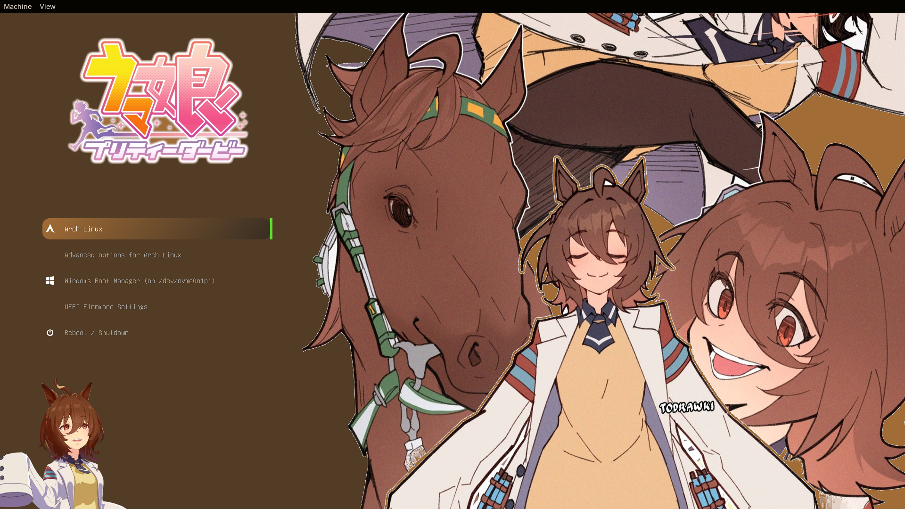

# Tachyon Grub Theme

This is the most SIMPLEST grub theme of tachyon, literally just put three images together and called it a day



## Usage

Just like how you would normally install a grub theme

### Step 1

Download [this](https://github.com/summerwya/grub-tachyon/archive/refs/heads/main.zip) repo

### Step 2

Extract the `grub-tachyon-main` folder inside the zip to `/boot/grub/themes`

or

```bash
# Execute this in the same folder as the zip you downloaded
sudo unzip -o grub-tachyon-main.zip -d /boot/grub/themes
```

### Step 3

Add/Set this in your grub config (`sudo nano /etc/default/grub`)

```bash
GRUB_THEME="/boot/grub/themes/grub-tachyon-main/theme.txt"
GRUB_TIMEOUT_STYLE=menu # Optional
```

then rebuild grub!

```bash
# Assuming you use arch:
sudo grub-mkconfig -o /boot/grub/grub.cfg
```

## TODO

- Customize it more
- Maybe make the selection png look like a button from the game

## Credits

- Character: [Agnes Tachyon](https://umamusu.wiki/Agnes_Tachyon) from [Umamusume: Pretty Derby](https://umamusume.com/)
- Background: from [this](https://www.instagram.com/p/DNl9ggxzq4i/) instagram post (Art by [@todrawki](https://www.instagram.com/todrawki/) on instagram as well)

> [!NOTE]
> Best used with the Atlan Semi Bold font!